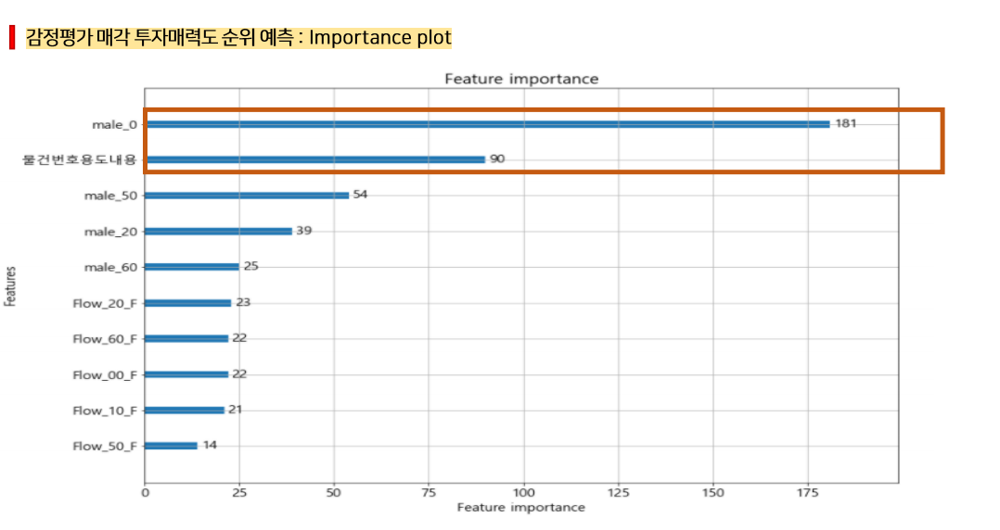
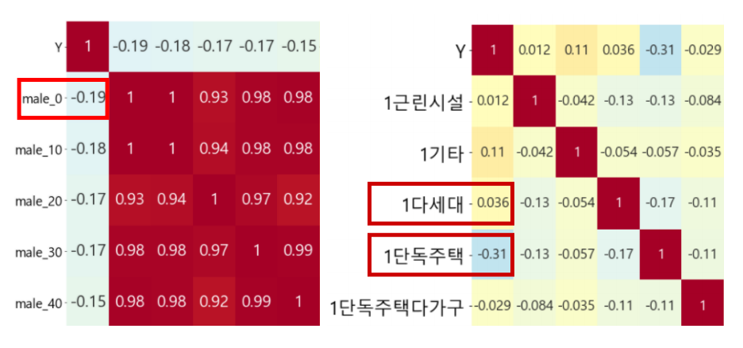
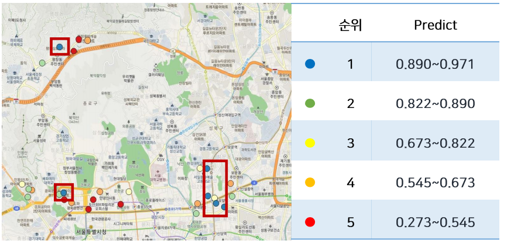
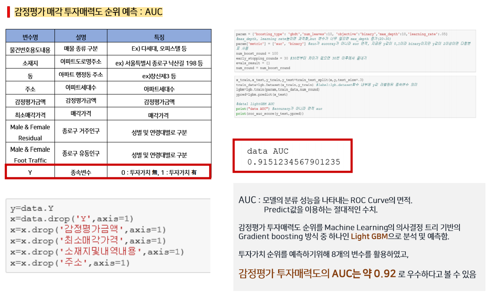
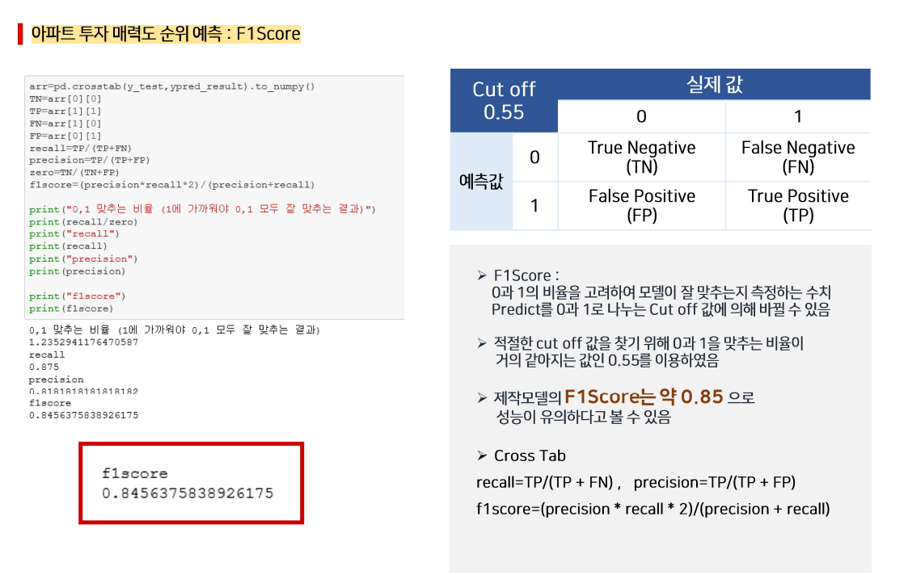

# BC-Financial-Data-Contest
BC Card Financial Big Data Contest(3th)

## Topic

Industry and commercial growth forecasting ideas using consumption data

## Environment

- python3
- LightGBM
- Geocoding(you can use in google sheet without download)
- QGIS

## Installation

```
$ pip install lightgbm
```

Clone Repository...

```sh
$ mkdir project
$ cd project
$ git clone https://github.com/DongChanKIM2/BC-Financial-Data-Contest.git
$ cd BC-Financial-Data-Contest
```


## Results











## Feedback

This is my first time to won the big data contest

I've heard that more than 200 teams participated, and I was very happy to get the result of being third among them

Looking at the announcement of the first and second winners, I noticed that there is a difference

They thought a lot about how to use the results more than I do

Anyway, I am so happy to get my first prize and thanks to 태균, 세현
